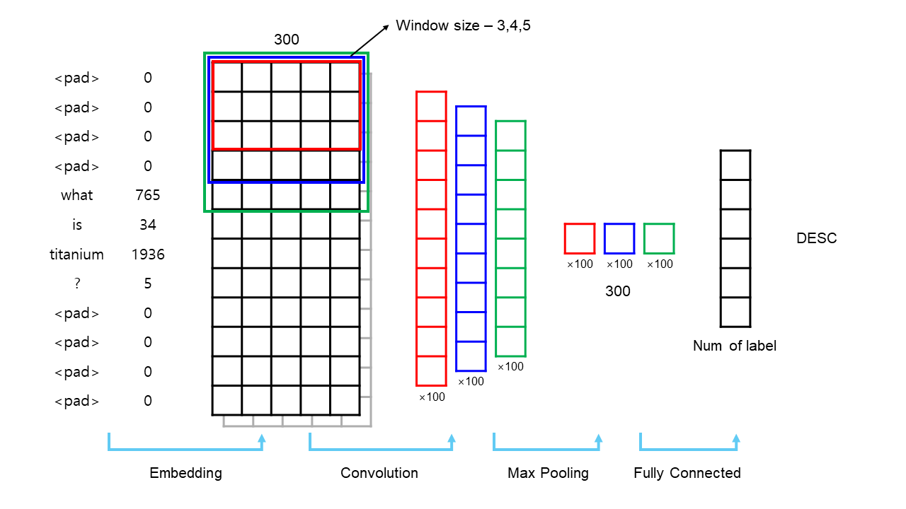

# Convolutional Neural Networks for Sentence Classification

This is the implementation of [Convolutional Neural Networks for Sentence Classification](https://aclanthology.org/D14-1181) (Kim, EMNLP 2014) on python with numpy library.

## Results

## Specification

- **model.py** : CNN model for sentence classification
- **train.py** : Training process
- **utils.py** : Preprocessing, etc.

### Detail about Model

## Training Dataset
["MR"](https://www.cs.cornell.edu/people/pabo/movie-review-data/): Movie reviews with one sentence per review. Classification involves detecting positive/negative reviews (Pang and Lee, 2005).  
["SST-1"](https://nlp.stanford.edu/sentiment/): Stanford Sentiment Treebank — an extension of MR but with train/dev/test splits provided and fine-grained labels (very positive, positive, neutral, negative, very negative), re-labeled by Socher et al. (2013).  
["SST-2"](https://nlp.stanford.edu/sentiment/): Same as SST-1 but with neutral reviews removed and binary labels.  
["Subj"](https://www.cs.cornell.edu/people/pabo/movie-review-data/): Subjectivity dataset where the task is to classify a sentence as being subjective or objective (Pang and Lee, 2004).  
["TREC"](https://cogcomp.seas.upenn.edu/Data/QA/QC/): TREC question dataset—task involves classifying a question into 6 question types (whether the question is about person, location, numeric information, etc.) (Li and Roth, 2002).  
["CR"](https://www.cs.uic.edu/~liub/FBS/sentiment-analysis.html): Customer reviews of various products (cameras, MP3s etc.). Task is to predict positive/negative reviews (Hu and Liu, 2004).  
["MPQA"](https://mpqa.cs.pitt.edu/): Opinion polarity detection subtask of the MPQA dataset (Wiebe et al., 2005).

## Development Environment
- OS: Ubuntu 18.04.5 LTS (64bit)
- Language: Python 3.10.13
- CPU: Intel(R) Core(TM) i7-8700K CPU @ 3.70GHz
- GPU: GeForce GTX 1080 Ti

## Requirements
    numpy==1.26.3
    gensim==4.3.2
    scikit-learn==1.3.0
    torch==2.3.0
    pytorch-cuda==11.8

## Execution
    python train.py --model rand --task trec